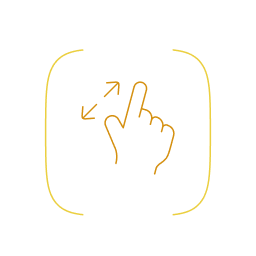
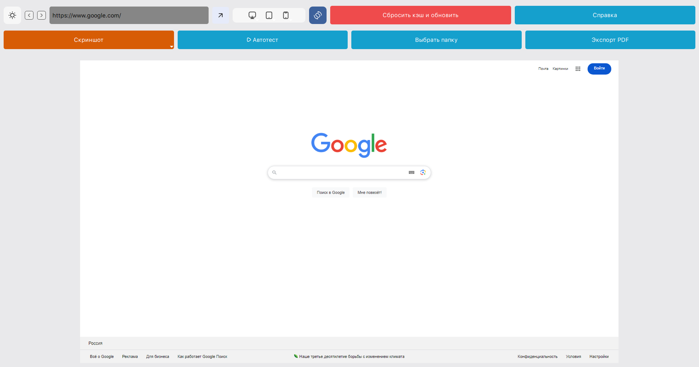

# Resolutions Lab

  
**Тестируйте адаптивность веб-сайтов с лёгкостью**

Resolutions Lab — это десктопное приложение для проверки отображения веб-сайтов на популярных разрешениях смартфонов, планшетов и ноутбуков. Поддерживает переключение User-Agent, создание скриншотов (видимой области, физического размера и всей страницы), экспорт в PDF и автоматическое тестирование всех разрешений.

---

## Основные возможности
- **Выбор разрешений**: Тестируйте сайты на устройствах вроде iPhone 15 Pro Max, iPad Pro, Pixel 8 Pro и других.
- **Смена ориентации**: Переключайтесь между портретной и ландшафтной ориентацией.
- **Скриншоты**: Сохраняйте видимую область, физический размер или всю страницу.
- **Автотест**: Автоматически создавайте скриншоты для всех доступных разрешений.
- **Экспорт в PDF**: Сохраняйте страницы в формате PDF.
- **Тёмная/светлая тема**: Выбирайте удобный интерфейс.
- **Обновления**: Автоматическая проверка новых версий через GitHub Releases.

---

## Как начать
1. Скачайте последнюю версию приложения из раздела [Releases](https://github.com/exJabberwocky/ResolutionsLab/releases).
   - Для Windows: `Resolutions Lab_Windows.exe`
   - Для macOS: `Resolutions Lab_MacOS`
2. Запустите файл:
   - На Windows: просто дважды щёлкните по `.exe`.
   - На macOS: просто дважды щёлкните по `ResolutionsLab`.
3. Введите URL сайта в поле ввода (например, `https://example.com`) и нажмите "Перейти".

Подробности — в разделе "Справка" приложения.

---

## Скриншоты
| Тёмная тема | Светлая тема |
|-------------|--------------|
|  |  |

---

## Обновления
Приложение автоматически проверяет наличие новых версий при запуске через GitHub Releases. Если доступно обновление, вы увидите уведомление с ссылкой на скачивание.

---

## Лицензия
Проект распространяется под лицензией [MIT](LICENSE). Вы можете свободно использовать, модифицировать и распространять код.

---

## Контакты
- **Автор**: ex_Design
- **Telegram**: [@JabberWocky79](https://t.me/JabberWocky79)
- **Канал**: [t.me/ex_jabberwocky](https://t.me/ex_jabberwocky)

Если у вас есть вопросы или предложения, пишите!

---

*Resolutions Lab | 2025*

